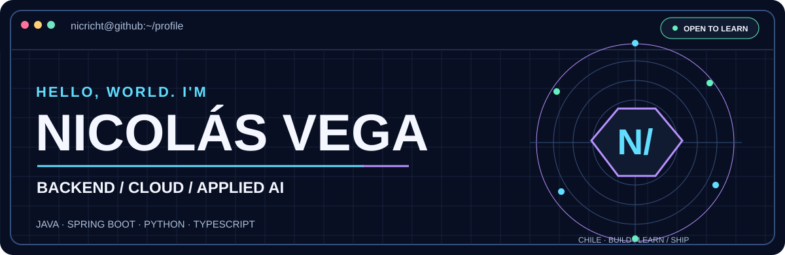
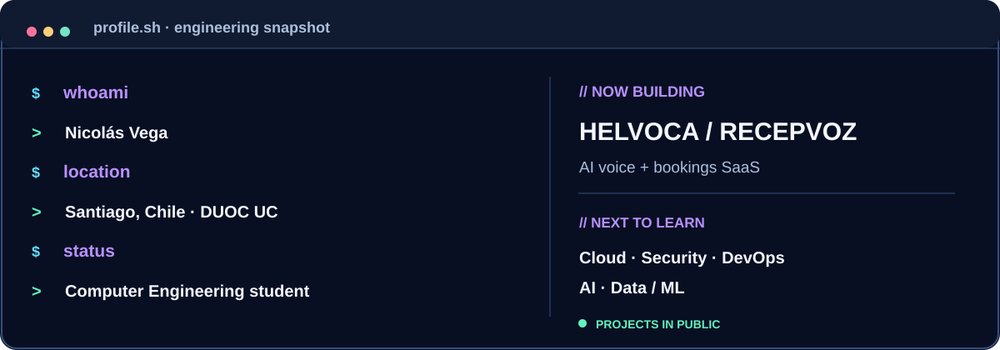
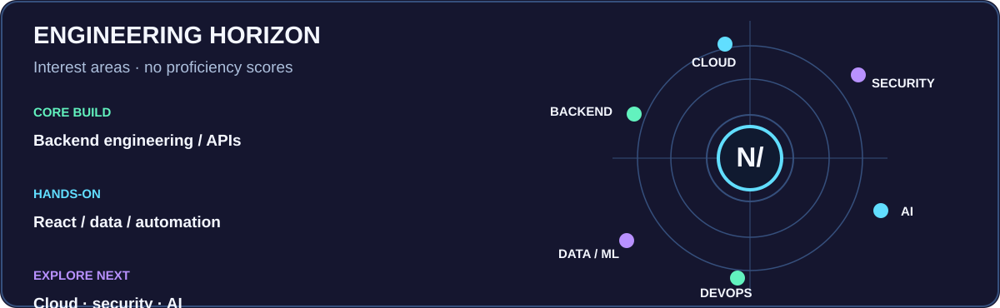
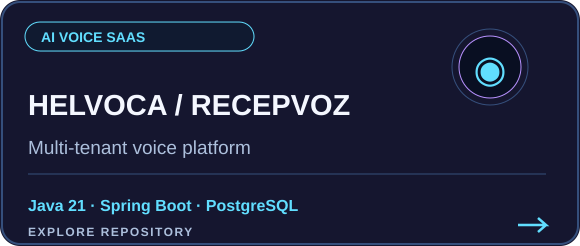
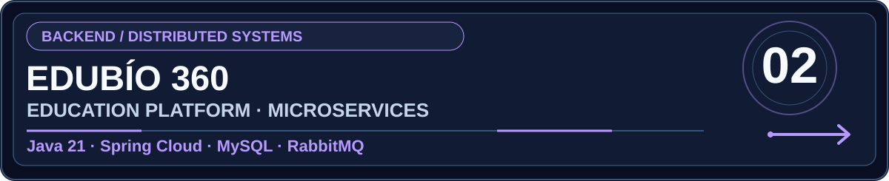
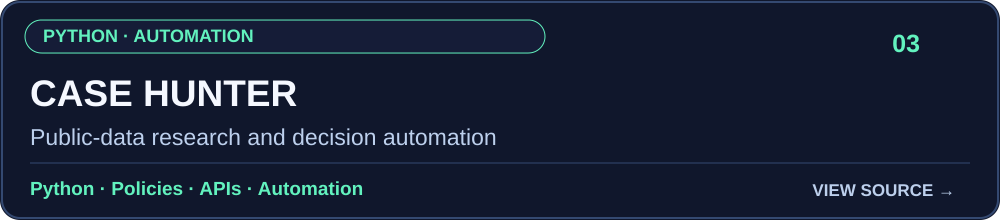
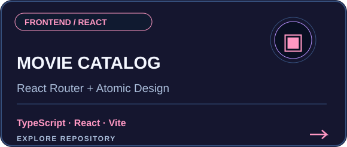

<!-- Original visual identity: CYBER / TERMINAL. All local graphics are editable SVGs. -->
<picture>
  <source media="(prefers-color-scheme: dark)" srcset="assets/banner-dark.svg" />
  <source media="(prefers-color-scheme: light)" srcset="assets/banner-light.svg" />
  
</picture>

 

 

---

### `nicricht@github:~$ whoami`

<picture>
  <source media="(prefers-color-scheme: dark)" srcset="assets/terminal-dark.svg" />
  <source media="(prefers-color-scheme: light)" srcset="assets/terminal-light.svg" />
  
</picture>

I am **Nicolás Vega**, a Computer Engineering student at **DUOC UC**, based in Chile. I am interested in creating useful, maintainable products, especially **backend systems, APIs, automation and applied AI**.

> **Mi enfoque:** aprender construyendo proyectos reales, documentando decisiones y mejorando la calidad del software en cada iteración.

### `nicricht@github:~$ cat stack.yml`

<table>
<tr><td valign="top" width="50%">

<strong>Languages &amp; framework experience</strong>

</td><td valign="top" width="50%">

<strong>Databases &amp; engineering tools</strong>

</td></tr>
</table>

**Currently exploring:** Cloud platforms · Cybersecurity · Data / ML · DevOps · Applied AI.

### `nicricht@github:~$ cat engineering-horizon.svg`

<picture>
  <source media="(prefers-color-scheme: dark)" srcset="assets/focus-map-dark.svg" />
  <source media="(prefers-color-scheme: light)" srcset="assets/focus-map-light.svg" />
  
</picture>

### `nicricht@github:~$ ls projects/ --featured`

<table>
<tr>
<td width="50%">

</td>
<td width="50%">

</td>
</tr>
<tr>
<td>

</td>
<td>

</td>
</tr>
</table>

<b>What each project is about</b>

- **[Helvoca / RecepVoz](https://github.com/Nicricht/helvoca):** multi-tenant AI telephone reception platform built around appointments, service catalogs, business knowledge and voice workflows.
- **[EduBío 360](https://github.com/Nicricht/edubio360):** educational platform backend using Spring Boot microservices, service discovery, API gateway and asynchronous messaging.
- **[Case Hunter](https://github.com/Nicricht/casehunter):** Python workflow for finding, validating and prioritizing public business opportunities with auditable decision policies.
- **[Movie Catalog](https://github.com/Nicricht/Fullstack):** React + TypeScript student project with routing and Atomic Design components.

### `nicricht@github:~$ git log --activity`

### `nicricht@github:~$ contact --connect`

 
 
CHILE · BUILD / LEARN / SHIP · Designed with SVG, HTML & Markdown

