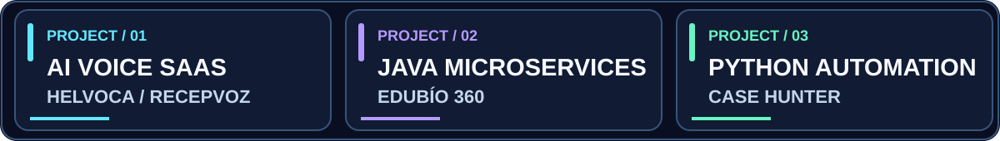

<picture><source media="(prefers-color-scheme: light)" srcset="assets/banner-light.svg"/><source media="(prefers-color-scheme: dark)" srcset="assets/banner-dark.svg"/></picture>

<strong>JAVA · SPRING BOOT · REST APIs · SQL · AUTOMATION</strong>

<a href="https://github.com/Nicricht/helvoca"><strong>▶ EXPLORE HELVOCA</strong></a> · <a href="#selected-projects"><strong>VIEW CODE</strong></a> · <a href="mailto:nic.vegal@duocuc.cl"><strong>CONTACT</strong></a>

<picture><source media="(prefers-color-scheme: light)" srcset="assets/proof-light.svg"/><source media="(prefers-color-scheme: dark)" srcset="assets/proof-dark.svg"/></picture>

## Featured project: [Helvoca / RecepVoz](https://github.com/Nicricht/helvoca)

<a href="https://github.com/Nicricht/helvoca"><picture><source media="(prefers-color-scheme: light)" srcset="assets/project-helvoca-light.svg"/><source media="(prefers-color-scheme: dark)" srcset="assets/project-helvoca.svg"/></picture></a>

**What I built:** A multi-tenant AI voice reception system with authentication, reservations, service catalogs, business knowledge and backend-controlled workflows.

**Tech:** Java 21 · Spring Boot · Spring Security · PostgreSQL · Flyway · Docker · GitHub Actions

**[See the source code and architecture →](https://github.com/Nicricht/helvoca)**

## More projects with real code

<a href="https://github.com/Nicricht/edubio360"><picture><source media="(prefers-color-scheme: light)" srcset="assets/project-edubio-light.svg"/><source media="(prefers-color-scheme: dark)" srcset="assets/project-edubio.svg"/></picture></a>

**[EduBío 360](https://github.com/Nicricht/edubio360):** Higher-education microservices, API Gateway, service discovery, MySQL and RabbitMQ.

<a href="https://github.com/Nicricht/casehunter"><picture><source media="(prefers-color-scheme: light)" srcset="assets/project-casehunter-light.svg"/><source media="(prefers-color-scheme: dark)" srcset="assets/project-casehunter.svg"/></picture></a>

**[Case Hunter](https://github.com/Nicricht/casehunter):** Python automation for public-data research, prioritization, deduplication and auditable decision policies.

<strong>Show my React / TypeScript coursework project</strong>

<a href="https://github.com/Nicricht/Fullstack"><picture><source media="(prefers-color-scheme: light)" srcset="assets/project-fullstack-light.svg"/><source media="(prefers-color-scheme: dark)" srcset="assets/project-fullstack.svg"/></picture></a>

**[Movie Catalog](https://github.com/Nicricht/Fullstack):** Student project applying React Router, dynamic routes, typed props, Vite and Atomic Design.

## What I bring to a team

I am **Nicolás Iván Vega Linero**, a **Computer Engineering student at DUOC UC** in Chile, focused on **Java backend development, APIs, SQL and automation**. My public repositories demonstrate hands-on work with multi-tenant services, microservices, testing and full-stack fundamentals.

<picture><source media="(prefers-color-scheme: light)" srcset="assets/terminal-light.svg"/><source media="(prefers-color-scheme: dark)" srcset="assets/terminal-dark.svg"/></picture>

**Used in projects:** Java · Spring Boot · SQL · PostgreSQL · MySQL · Docker · Git / GitHub · Python · TypeScript / React

**Learning next:** Cloud infrastructure · Cybersecurity · DevOps · Applied AI.

<strong>Explore my technical learning direction</strong>

<picture><source media="(prefers-color-scheme: light)" srcset="assets/focus-map-light.svg"/><source media="(prefers-color-scheme: dark)" srcset="assets/focus-map-dark.svg"/></picture>

*This is a map of interests and project experience, not a proficiency score.*

<strong>View GitHub activity</strong>

---

<strong>Interested in Java backend, software engineering and practical products?</strong>

<a href="mailto:nic.vegal@duocuc.cl"><strong>EMAIL</strong></a> · <a href="https://github.com/Nicricht?tab=repositories"><strong>ALL REPOSITORIES</strong></a> · <a href="https://github.com/Nicricht"><strong>GITHUB</strong></a>

CHILE · BUILD / LEARN / SHIP · GitHub-safe animated SVG, no JavaScript or external runtime required

